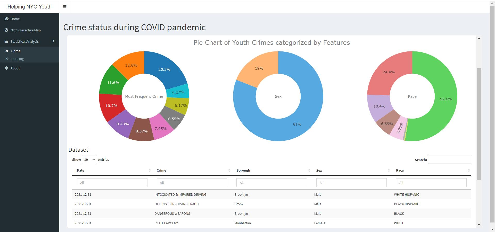

# Project 2: Shiny App Development

### [Project Description](doc/project2_desc.md)




## Helping NYC Youth during COVID

**Term**: Spring 2022

*Team #9*

**Team members:** 
  - Rhea Sablani
  - Xile Zhang
  - Yvonne Zha
  - Sharon Meng

*_Click here for our [**Shiny app**](http://ads-project2.shinyapps.io/project2)._

**Project Summary:** 

The COVID-19 pandemic has had a drastic impact on all of us whether it’s losing a job, getting behind on rent or mortgage payments, or struggling to bring food to the table. It has been even harder for low income families to have access to the resources they need to stay safe and healthy. In an effort to help low income families, specifically the youth, as they might find it challenging to navigate these unprecedented times, we created this app. We’re hopeful that our aggregated resources to covid and flu vaccination sites, food, shelter, after school centers, job/internship opportunities, and crime rates will play a small but crucial role in supporting the youth of New York City.

In this app, We mainly developed 3 functions, the interactive map, statistical analysis and about.

+ Interactive Map:
  + Locations for Covid vaccination, flu shots, wifi, food centers, drop in centers, youth shelters, job/internship centers
  + Heatmap distribution of covid cases and crime 

+ Statistical Analysis:
  + Graphs of crime status during covid pandemic, explanation for some phenomena and conclusion 
  + Graphs of housing status during covid pandemic, explanation for some phenomena and conclusion 

+ About:
  + Links to data sources, data disclaimer, app contributors
 

**[Contribution statement]**: 

- **Rhea Sablani (Presenter)**: Assisted in motivation for topic selection and outlining framework for app content and layout. Performed additional research on successful features from previous projects to consider implementing. Made contributions to COVID and Crime Interactive Map heatmap content, layout, and icon selection. Completed About page and content for Home page. Created data story and presented to class.
- **Xile Zhang**: Raised the topic, collected complete and related data and wrote the framework planning of the project. Collected and processed all related data in Interactive Map page. Contributed to the Interactive Map page by creating three covid-related heatmaps. Contributed to the Statistical Analysis page by improving the analysis of Housing status during COVID pandemic. Produced a related reading document to help understanding the data story.
- **Yvonne Zha**: Participated in topic selection. Researched and concluded apps from former semesters to find their advantages and absorbed these points to initialize the shiny app. Implemented the home page and helped to polish all pages of the app. Added markers with combine-and-split effect on the interactive map. Integrated different parts from team members into the final app.
- **Sharon Meng**: Recorded the process of the whole project regularly on a team google doc and hosted zoom meetings for remote communication. Designed the template for the Shiny App page including `Home` and `Statistical Analysis` page. Cleaned and visualized all related data about crime, housing and COVID status in NYC to create plots in the `Statistical Analysis` page, explained the graphs and came out with some conclusions. Organized all files used in this app and wrote all `xxx.md` files in Github. 

	In all, all team members contributed **equally** in all stages of this project. All team members approve our work presented in this GitHub repository including this contributions statement.


---

Following [suggestions](http://nicercode.github.io/blog/2013-04-05-projects/) by [RICH FITZJOHN](http://nicercode.github.io/about/#Team) (@richfitz). This folder is orgarnized as follows.

```
proj/
├── app/
├── lib/
├── data/
├── doc/
```

Please see each subfolder for a README file.

